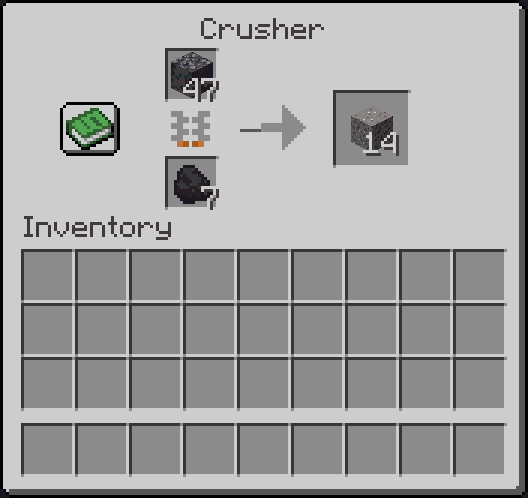
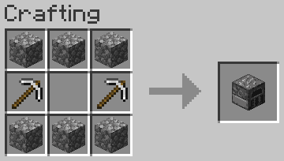
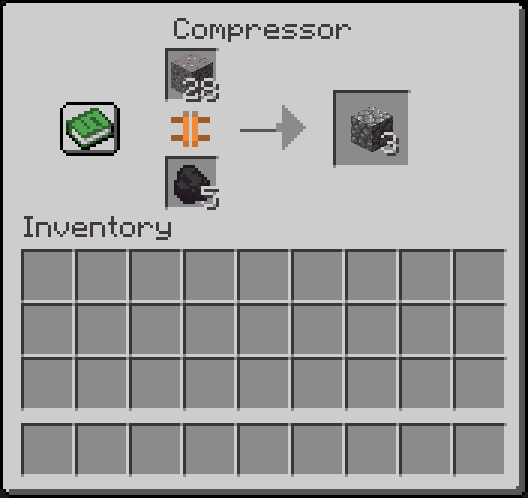
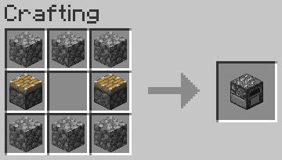

# Crusher and Compressor (Fabric)

Almost everything is crushable. Whether it is sensible and profitable to crush some things is quite another matter.
You can even crush sand, but you will get only sand, and gain some experience.

The Crusher works similar to a furnace, and has a similar recipe:

The Compressor can sometimes reverse the action of the Crusher.
And sometimes it can create new things.

It also works similar to a furnace, and even has a similar recipe:

## License

Standard MIT license. Feel free to learn from it and incorporate it in your own projects.

## Source code

Available on [GitLab](https://gitlab.com/pintergabor/crusher.git) or [GitHub](https://github.com/pinter-gabor-at/crusher.git)

## For developers

Quite often, when I start learning programming on a new platform, I find even the simplest examples too complicated.
Tutorials, written by experts, with years of experience programming on that platform, sometimes forget how difficult those first step are.  
This is why I decided to make all my Minecraft mods publicly available.

## Requires
- [Fabric API](https://modrinth.com/mod/fabric-api)

## Thanks

This mod was inspired by [Stone Crusher](https://modrinth.com/mod/stone-crusher) made by [Blyrium](https://modrinth.com/user/Blyrium).
Reading his code helped me a lot.

## See also

My other mods on [Modrinth](https://modrinth.com/user/pinter.gabor) and on [CurseForge](https://www.curseforge.com/members/pintergabor/projects).
